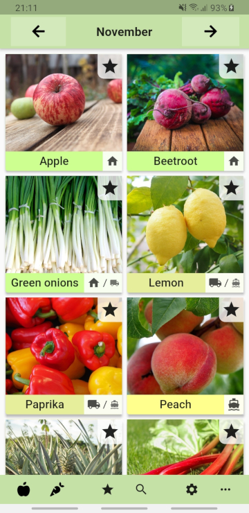
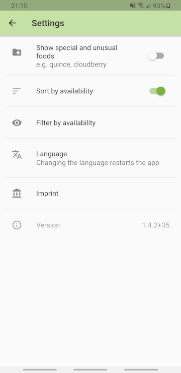

# seasoncalendar

This app is a practical and easy to use tool showing you which kinds of fruit, vegetables, salads etc. are in season right now.

Foods that are produced regionally are often times cheaper, tastier and better for the environment due to a shorter and more convenient transport.

**I aim at continuously extending the languages and regions supported!**

- _Supported Languages: German, English, French_
- _Supported Regions: Central Europe_

## Features

There certainly are similar apps out there, especially within the German-speaking community. However, this app:

- Boasts the biggest collection of foods,
- Lets you pick and view your favorites,
- Consists of open source code,
- Can be run on a variety of android devices, and
- Looks and feels better than most competitor apps (my personal opinion).

Especially the open-source aspect is a main motivating factor for me to further develop this app.

## Get it!

- **From here:** check out the [Releases](https://github.com/Flunzmas/seasoncalendar/releases) tab of this repo for a fresh APK.
- **From Google Play**: https://play.google.com/store/apps/details?id=flunzmas.seasoncalendar
- **From F-Droid**: *coming soon!*

Additional info can be fetched from my website: https://flunzmas.com/seasonal-foods-calendar

## Screenshots

 

## Asset Sources

The database file `assets/db/foods.db` contains all food information and their respective sources. You can open the file e.g. with .

Please note that the data concerning foods' availability partly stems from  and thus is __not__ subject to the GPL license. I kindly ask you to contact me before re-using the availability data (columns starting with 'av' from the file `assets/db/foods.db`).

# Building it Yourself

0. Clone the repo
1. `flutter pub get`
2. `flutter update-packages`
3. `flutter build apk --debug` **or** `flutter build apk --release`

_You need an own key to sign release versions of this app._

_Helpful info:_ https://flutter.dev/docs/deployment/android
