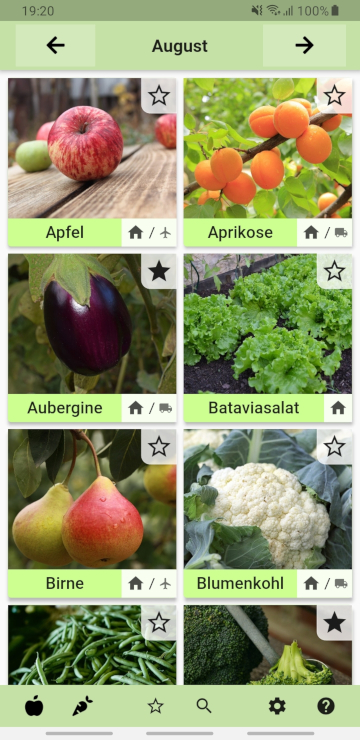
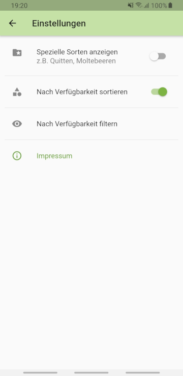

# seasoncalendar

This app is a practical and easy to use tool showing you which kinds of fruit, vegetables, salads etc. are in season right now.

Foods that are produced regionally are often times cheaper, tastier and better for the environment due to a shorter and more convenient transport.

Stay tuned!

## Get it!

- **From Google Play**: https://play.google.com/store/apps/details?id=flunzmas.seasoncalendar
- **From F-Droid**: *coming soon!*
- **From my website**: https://flunzmas.com/seasonal-foods-calendar

## Screenshots

 

## Asset Sources

The database file `assets/db/foods.db` contains all food information and their respective sources. You can open the file e.g. with 

# Installation

0. Clone the repo
1. `cd seasoncalendar`.
2. `mv assets/text/imprintpagetext_template.json assets/text/imprintpagetext.json`.
3. Override the contact data of the imprint if desired.
4. `flutter build appbundle` (builds a release bundle).
5. The bundle is available at `./build/app/outputs/bundle/release/app.aab`.

_Helpful info:_ https://flutter.dev/docs/deployment/android
