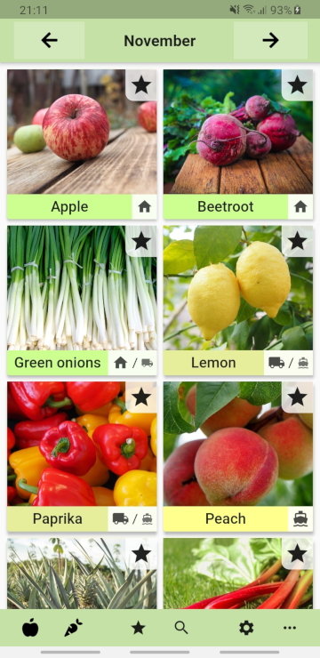
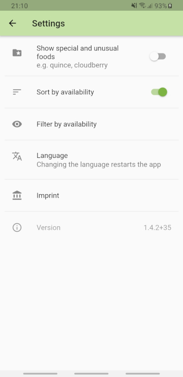

## Update Nov 8. 2024: End of App Life

I have decided to archive the app's repository and unlist it on Google Play. I won't find the time to work on this project anymore, and I don't want to offer an app that deteriorates in quality as I struggle to keep it maintained. The app in its current version will remain available on F-Droid. 

**A sincere thank you to all contributors, and to the users for 5000+ installs and 2000+ peak installed audience!**

# Seasonal Foods Calendar

A practical and easy to use app showing you which kinds of fruit, vegetables, salads etc. are in season right now.

Foods that are produced regionally are often times cheaper, tastier and better for the environment due to a shorter and more convenient transport.

### Screenshots

 

## Features

There certainly are similar apps out there, especially within the German-speaking community.

However some distinguishing features are:

- Huge database
  - Over 100 different kinds of foods and their availability ([contribute and improve information](https://github.com/seasoncalendar/seasoncalendar/issues/29))
- Save favorite foods
- Modern design
- No Advertisement & No Tracking (never!)
- Runs on a variety of android devices (Android 4.1 or newer)
- [Multiple languages](https://github.com/seasoncalendar/seasoncalendar/issues/36) (and coming soon [multiple regions](https://github.com/seasoncalendar/seasoncalendar/issues/47))
- Free Open Source Software

Especially the open-source aspect is a main motivating factor for me to further develop this app.

Additional info can be fetched from my website: [flunzmas.com/seasonal-foods-calendar](https://flunzmas.com/seasonal-foods-calendar)

## Asset Sources

The database file `assets/db/foods.db` contains all food information and their respective sources. You can open the file e.g. with [the official SQLite DB Browser](https://sqlitebrowser.org/).

Please note that the data concerning foods' availability partly stems from [lebensmittellexikon.de](https://lebensmittellexikon.de/) and thus is __not__ subject to the GPL license. I kindly ask you to contact me before re-using the availability data (columns starting with 'av' from the file `assets/db/foods.db`).

# Building it Yourself

0. Clone the repo
1. `flutter pub get`
2. `flutter update-packages`
3. `flutter pub run intl_utils:generate`
4. `flutter build apk --debug --flavor <flavor>` **or** `flutter build apk --release --flavor <flavor>`

(replace `<flavor>` with `googleplay` for the Google Play version, `foss` for the full version) 
